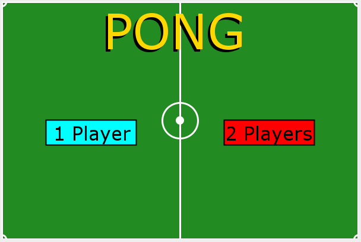
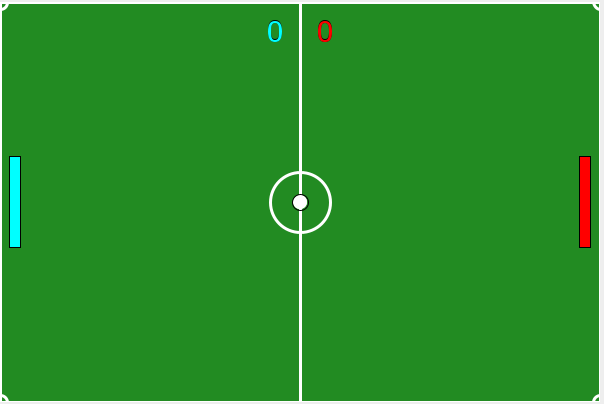

# Pong

> A version of the Pong game I developed.

---

### Table of Contents

- [Description](#description)
- [How To Use](#how-to-use)
- [Author Info](#author-info)

---

## Description

This is my version of the classic Pong game with two game modes:player vs artificial intelligence or player vs player.
I also developed a simple menu to choose between game modes. At the end of each game we can return to the menu and play again.

---

## How To Use
In this project I used several functions of CanvasLib, a library made by my programming teacher, so to run the code, it is necessary to download the folder "libs" and the file "build.gradle.kts".

When playing the AI vs Player game, you play with the mouse. 
If playing Player vs Player, player 1 (from the left) controls his racket with the W and S keys and player 2 (from the right) controls his racket with the up and down arrows

---

## Author Info

- Twitter - [@andre_j3sus](https://twitter.com/andre_j3sus)
- Website - [André Jesus](https://sites.google.com/view/andre-jesus/p%C3%A1gina-inicial)

[Back To The Top](#pong)